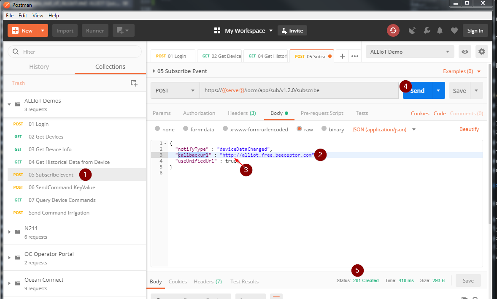

#How to get your data out of ALLIoT


- [Get all devices of your application](#get-all-devices-of-your-application)
- [Get historical data of your device](#get-historical-data-of-your-device)
- [Push the data to your server](#push-the-data-to-your-server)
  - [Add Subscription](#add-subscription)
  - [Delete Subscription](#delete-subscription)


Be sure that you have a valid accessToken, otherwise Login again.  
[Connect to the Rest API](06_Connect_to_REST_API.md)

## Get all devices of your application

1. Select `02 Get Devices`from the ALLIoT Demo Connection
2. Press "Send"

Detail: 
GET Request to URL with access Token  
`https://{{server}}/iocm/app/dm/v1.3.0/devices?appId={{appId}}&pageNo=0&pageSize=10  `  

{{server}} and {{appId}} are Variables from your Environment.

Header:   
```
"app_key: <<appId>
"Authorization:Bearer <<accessToken>> 
Content-Type:application/json;
```

In the Response you should see a JSON Object with all your Devices.

Example Response:
```json
{
    "totalCount": 9,
    "pageNo": 0,
    "pageSize": 10,
    "devices": [
        {
            "deviceId": "3c9b523d-b17c-XXXX-97e0-64e1d05d1267",
            "gatewayId": "3c9b523d-b17c-XXXX-97e0-64e1d05d1267",
            "nodeType": "GATEWAY",
            "createTime": "20190114T142233Z",
            "lastModifiedTime": "20190123T151214Z",
            "deviceInfo": {
                "nodeId": "357518080213275",
                
                ...
                ...
                ...
            }
        }
    ]
}
```


## Get historical data of your device

NOTE: ALLIoT will only save your data up to 30 Days.  
In the last command you see this Line:  
`"deviceId": "3c9b523d-b17c-XXXX-97e0-64e1d05d1267"`  
**This is the unique DeviceID - for the next Request you have add this ID to your Environment to deviceId.**

1. Select `04 Get Historical Data from Device`from the ALLIoT Demo Connection
2. Press "Send"

Detail:  
GET Request to URL:  
```
https://{{server}}/iocm/app/data/v1.1.0/deviceDataHistory?deviceId={{deviceId}}&gatewayId={{deviceId}}&startTime=20181015T000000Z&endTime=20291015T000000Z&appId={{appId}}
```

{{server}}, {{appId}} and {{deviceId}} are Variables from your Environment.
The time period can be set via the parameters startTime and endTime.

Header:   
```
"app_key: <<appId>
"Authorization:Bearer <<accessToken>> 
Content-Type:application/json;
```

Example Response:
```json
{
    "totalCount": 5,
    "pageNo": 0,
    "pageSize": 5,
    "deviceDataHistoryDTOs": [
        {
            "deviceId": "702b7c34-XXXX-4278-be01-d4587c38e077",
            "gatewayId": "702b7c34-XXXX-4278-be01-d4587c38e077",
            "appId": "XXXX_y4UGGh5D9EU17793YsA55Aa",
            "serviceId": "Irrigation",
            "data": {
                "Temperature": 15,
                "Moisture": 40
            },
            "timestamp": "20190128T121043Z"
        },
        {
            "deviceId": "702b7c34-XXXX-4278-be01-d4587c38e077",
            "gatewayId": "702b7c34-XXXX-4278-be01-d4587c38e077",
            "appId": "XXXX_y4UGGh5D9EU17793YsA55Aa",
            "serviceId": "Irrigation",
            "data": {
                "Temperature": 10,
                "Moisture": 70
            },
            "timestamp": "20190128T115740Z"
        },
        {
            "deviceId": "702b7c34-XXXX-4278-be01-d4587c38e077",
            "gatewayId": "702b7c34-XXXX-4278-be01-d4587c38e077",
            "appId": "XXXX_y4UGGh5D9EU17793YsA55Aa",
            "serviceId": "Irrigation",
            "data": {
                "Temperature": 6
            },
            "timestamp": "20190128T114012Z"
        },
        
        ...
        ...

    ]
}
```

## Push the data to your server
With the ALLIoT Gateway it is also possible to push the data so your own Server.
So every time a device sends data, the data will be forwarded to your server immediately.

### Add Subscription

You only have to do this steps once.


1. Select `05 Subscribe Event`from the ALLIoT Demo Connection
2. Change `callbackurl` to your server URL, or use e.g. [Beeceptor](https://beeceptor.com/) for testing.
3. For this tutorial use HTTP instead of HTTPS. 
4. Press "Send"
5. Now you should get the response code 201 (Created).
6. From now all data is forward to your callback-URL (HTTP Endpoint)
7. You can repeat this steps for different callback-URLS (HTTP Endpoints)
8. Now send data from your device, and check if you will see it on your endpoint. 
   

https://beeceptor.com/ is a simple web service for HTTP(S) endpoint testing.

If you want to use HTTPS, you have to upload the Certificate of your Web server.  (ALLIoT -> Application -> Information -> Message Push -> certificate Manager)
   
### Delete Subscription
   1. Login to ALLIoT
   2. Goto "System Manage"
   3. Open your Application
   4. Select Tab "North Push Configuration"
   5. Delete your subscription from the "callback list"
   


